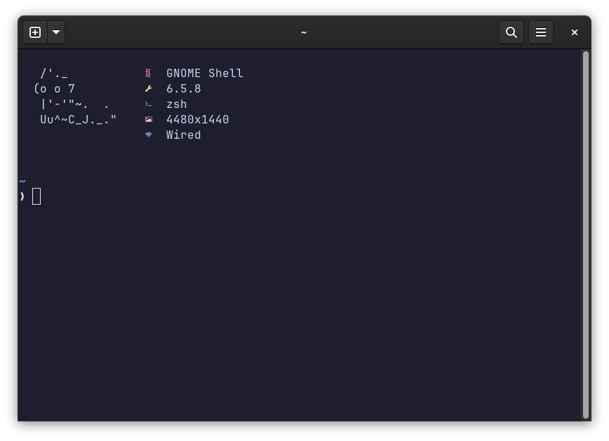
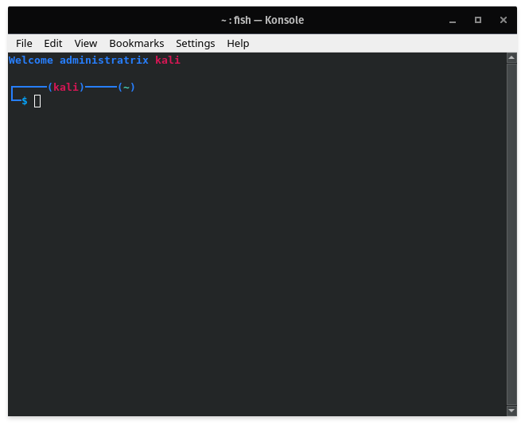
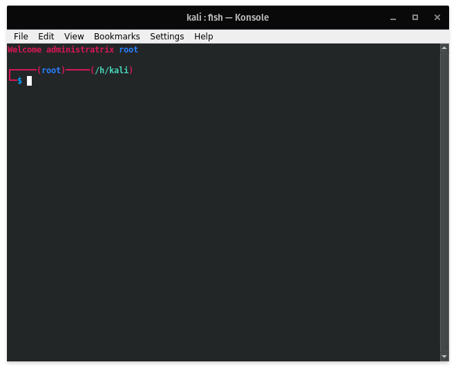

# Kali's shell customisations
Here you can find my customs scripts for all my shells, curently I only customised fish but maybe one day I will upload scripts for other shell too

> [!important]
> This repository is outdated, please check out my [dotfiles](https://github.com/Kalitsune/dotfiles) repository for more recent configurations
# **ZSH**
## **Overview**



the cat's face is randomized each time you launch your terminal!
## **Installation**
backup your `.zshrc` (and `.oh-my-zsh/` if it exists)
Copy the files in the [zsh directory](zsh) to your home directory.
Dowloand [Oh My ZSH!](https://ohmyz.sh/#install)
```sh
sh -c "$(curl -fsSL https://raw.githubusercontent.com/ohmyzsh/ohmyzsh/master/tools/install.sh)"
```
Download the [Pure](https://github.com/sindresorhus/pure) theme:
```sh
npm install --global pure-prompt
```
Download [ZSH Autosuggestions](https://github.com/zsh-users/zsh-autosuggestions):
```sh
git clone https://github.com/zsh-users/zsh-autosuggestions ${ZSH_CUSTOM:-~/.oh-my-zsh/custom}/plugins/zsh-autosuggestions
```
Download [ZSH Syntax Highlighting](https://github.com/zsh-users/zsh-syntax-highlighting):
```sh
git clone https://github.com/zsh-users/zsh-syntax-highlighting.git ${ZSH_CUSTOM:-~/.oh-my-zsh/custom}/plugins/zsh-syntax-highlighting
```
Done! You can customize the zsh plugins as you see fit. (you should probably install the tools in [#useful-tools](#useful-tools) or disable the related plugins, you can also check out [Catpuccin for Gnome terminal](https://github.com/catppuccin/gnome-terminal) if you'd like to have the same colors than me)

# **Fish**
## **Overview**



## **Installation**
you need [fish](https://github.com/fish-shell/fish-shell) to use these scripts, once it's done just do:

### **clone the repo using**
`git clone https://github.com/Kalitsune/shell-customisations`
 
### if you want to apply theses customisations to **the curent user only**:
`cp -r ./shell-customisations/fish ~/.config/fish/functions`

### if you want to apply theses customisations to **all users (root)**:
`sudo cp -r ./shell-customisations/fish /etc/fish/functions`

Congratulations, you're done !

# **GNOME Terminal**
I use [catpuccin for gnome terminal](https://github.com/catppuccin/gnome-terminal), suit yourself. (Theme: Mocha)

# **Usefull Tools**
install all (Fedora)
```sh
sudo dnf install -y thefuck autojump-zsh tealdeer fzf
```
## [TheFuck](https://github.com/nvbn/thefuck)
If you made a mistake while typing your command and it returns an error, you can press `esc` two times (or type `fuck`) and it will fix it for you.

install : (Fedora)
```sh
sudo dnf install -y thefuck
```
## [Autojump](https://github.com/wting/autojump)
Remembers the folder you went to a lot and let you type `j name` to automatically open this folder.
For example if I go to my Docs folder often (`~/Documents`), I can just go to it by typing `j docs` (or even `j d` if its a folder I use a hella lot)

install: (Fedora)
ZSH:
```sh
sudo dnf install -y autojump-zsh
```
FISH:
```sh
sudo dnf install -y autojump-fish
```
ANY: (may require aditional setup)
```sh
sudo dnf install -y autojump
```

## [LunarVim](https://www.lunarvim.org/)
Vim but modded with a lot of usefull plugins, good base to start modding your vim without having to do much work. And it's usefull to have a terminal based IDE at times.
install:
```sh
bash <(curl -s https://raw.githubusercontent.com/LunarVim/LunarVim/release-1.3/neovim-0.9/utils/installer/install.sh)
```

## [Tealdeer](https://github.com/dbrgn/tealdeer)
Tealdeer is a cool cli tool that gives short, pretty and easy to read instructions about how to use some commands, it's litteraly the TLDR version of the manual (available through the `tldr` command)
install : (Fedora)
```sh
sudo dnf install -y tealdeer
```

## [Fuzzy Finder](https://github.com/junegunn/fzf)
Fzf (Fuzzy Finder) is a CLI tool similar to the find command that allows you to type the name of your files and find them very easiliy using the `fzf` command.

install : (Fedora)
```sh
sudo dnf install -y fzf
```
