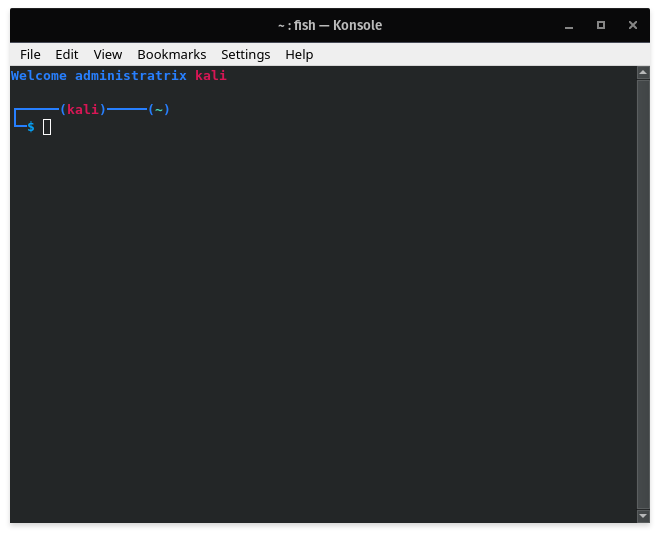
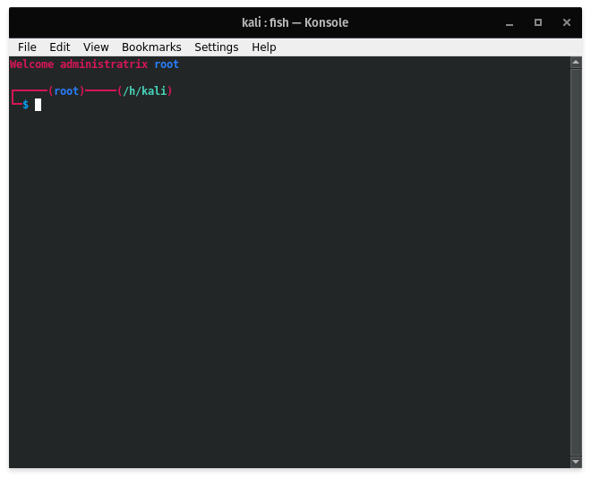

# Kali's shell customisations
Here you can find my customs scripts for all my shells, curently I only customised fish but maybe one day I will upload scripts for other shell too

#
# **Fish**
## **Overview**

## **Installation**
you need [fish](https://github.com/fish-shell/fish-shell) to use these scripts, once it's done just do:

### **clone the repo using**
`git clone https://github.com/Kalitsune/shell-customisations`
 
### if you want to apply theses customisations to **the curent user only**:
`cp -r ./shell-customisations/fish/functions ~/.config/fish`

### if you want to apply theses customisations to **all users (root)**:
`sudo cp -r ./shell-customisations/fish/functions /etc/fish`

Congratulations, you're done !
